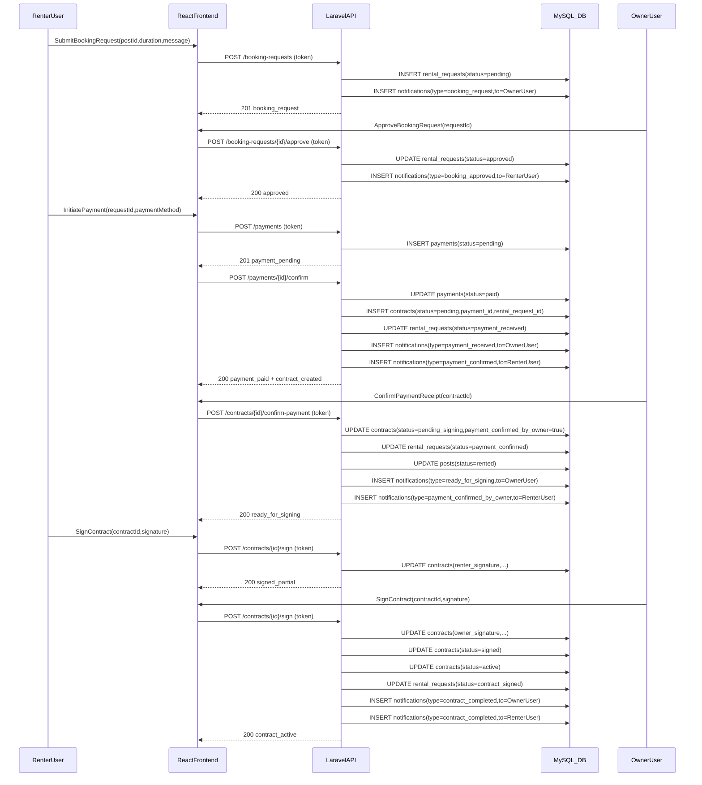
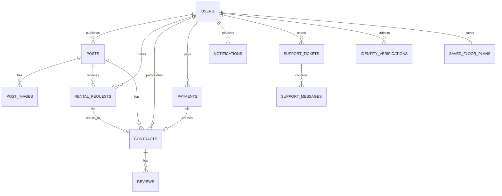

# وثيقة مشروع التخرج (6 فصول) — منصة عقارية ذكية

> **ملاحظة**: هذه الوثيقة مكتوبة بصيغة Markdown لتسهيل النسخ والمراجعة. يمكن نقلها لاحقًا إلى Word/PDF حسب قالب الكلية.  
> **تنبيه**: املأ الحقول بين الأقواس `[...]` قبل التسليم النهائي.

---

## صفحة العنوان

- **اسم الجامعة**: [....................]
- **كلية/قسم**: [كلية الحاسوب — هندسة البرمجيات]
- **عنوان المشروع**: منصة عقارية ذكية لإدارة الإعلانات والحجوزات والعقود مع توليد مخططات أرضية بالذكاء الاصطناعي وعرض ثلاثي الأبعاد
- **إعداد الطالب/الطلاب**: [....................]
- **الرقم الجامعي**: [....................]
- **إشراف**: [....................]
- **مناقشة**: [....................]
- **الفصل/السنة**: [فبراير 2026]

---

## الملخص (Abstract — Arabic)

يهدف هذا المشروع إلى تطوير منصة عقارية إلكترونية متكاملة تتيح نشر وإدارة الإعلانات العقارية، استقبال طلبات الحجز وإدارتها، تنفيذ تدفق دفع مبدئي، إنشاء العقود وإدارتها وتوقيعها إلكترونيًا، بالإضافة إلى نظام إشعارات ودعم فني ولوحة تحكم للمسؤول. تتميز المنصة بميزة توليد مخطط أرضية للعقار بالاعتماد على الذكاء الاصطناعي انطلاقًا من وصف نصي باللغة العربية، ثم تمثيل المخطط بصيغة ثنائية الأبعاد وعرضه أيضًا ثلاثي الأبعاد لتحسين فهم المستخدم للمساحة الداخلية. تم بناء النظام بنمط تطبيقات الويب الحديثة باستخدام Backend مبني على Laravel API مع توثيق وصلاحيات مبنية على Laravel Sanctum، وواجهة Frontend مبنية على React/Vite، مع قاعدة بيانات MySQL.  
تُظهر النتائج الأولية أن دمج المخططات المُولَّدة مع تجربة إضافة الإعلان يرفع من وضوح المعلومات للمستأجر/المشتري المحتمل، ويضيف قيمة عملية لإعلانات العقارات مقارنة بالمنصات التقليدية.

**الكلمات المفتاحية**: منصة عقارية، Laravel، React، حجز، عقد إلكتروني، توقيع، إشعارات، دعم فني، ذكاء اصطناعي، مخطط أرضية، 3D.

---

## Abstract (English — optional)

[Write 8–12 lines about the system, stack, and contributions.]

---

## شكر وتقدير (اختياري)

[نص الشكر والتقدير.]

---

## جدول المحتويات (Table of Contents)

- مقدمات
  - صفحة العنوان
  - الملخص
  - Abstract (English — optional)
  - شكر وتقدير
  - جدول المحتويات
  - قائمة الأشكال والمخططات
- **الفصل 1: المقدمة**
  - 1.1 خلفية عامة
  - 1.2 مشكلة المشروع
  - 1.3 أهداف المشروع
  - 1.4 نطاق المشروع وحدوده
  - 1.5 أصحاب المصلحة والمستخدمون
  - 1.6 المنهجية وخطة العمل
  - 1.7 هيكلة الوثيقة
- **الفصل 2: الدراسات السابقة**
  - 2.1 نظرة على الأنظمة المشابهة
  - 2.2 مقارنة منهجية
  - 2.3 الفجوة وإسهام المشروع
  - 2.4 المتطلبات غير الوظيفية المستقاة من الدراسات
- **الفصل 3: تحليل المتطلبات**
  - 3.1 المتطلبات الوظيفية (Functional Requirements)
  - 3.2 المتطلبات غير الوظيفية (Non-Functional Requirements)
  - 3.3 حالات الاستخدام (Use Case Diagram + Descriptions)
  - 3.4 سيناريوهات المستخدم ومعايير القبول
  - 3.5 نمذجة البيانات (ERD + Data Dictionary)
  - 3.6 مخططات سلوكية/تسلسلية
- **الفصل 4: التصميم**
  - 4.1 معمارية النظام
  - 4.2 تصميم الطبقات والأنماط
  - 4.3 تصميم واجهات API
  - 4.4 تصميم قاعدة البيانات (Schema Design)
  - 4.5 تصميم الواجهات وتجربة المستخدم (UI/UX)
  - 4.6 التصميم الأمني
  - 4.7 قرارات التصميم (Trade-offs)
- **الفصل 5: التنفيذ**
  - 5.1 بيئة التطوير والأدوات
  - 5.2 هيكلة المشروع
  - 5.3 وحدات الـ Backend
  - 5.4 وحدات الـ Frontend
  - 5.5 المزايا المميزة: AI Floor Plan + 3D + PDF RTL
- **الفصل 6: الاختبار والنتائج والخاتمة**
  - 6.1 خطة الاختبار
  - 6.2 حالات الاختبار (Test Cases)
  - 6.3 مصفوفة التتبّع (Traceability)
  - 6.4 النتائج والمناقشة
  - 6.5 الخاتمة
  - 6.6 أعمال مستقبلية
- ملاحق
  - ملحق (A): ملخص الـ API
  - ملحق (B): جداول قاعدة البيانات (ملخص)
  - ملحق (C): إعداد وتشغيل المشروع (مختصر)
  - المراجع (APA)

---

## قائمة الأشكال والمخططات

- شكل (4-1): معمارية النظام (Architecture Diagram)
- شكل (4-2): مخطط تسلسل تدفق الحجز→الدفع→العقد→التوقيع
- شكل (4-3): ERD للكيانات الأساسية
- شكل (3-1): مخطط حالات الاستخدام (Use Case Diagram) — *ملف صورة خارجي*
- شكل (3-2): مخطط نشاط لتدفق إضافة إعلان (Activity Diagram) — *ملف صورة خارجي*
- شكل (3-3): مخطط نشاط لتدفق العقد والتوقيع (Activity Diagram) — *ملف صورة خارجي*
- شكل (4-4): مخطط مكونات/نشر (Component/Deployment Diagram) — *ملف صورة خارجي*
- شكل (4-5): مخطط واجهات المستخدم (Wireframes/Screenshots) — *ملف صورة خارجي*

---

## الفصل 1: المقدمة

### 1.1 خلفية عامة

أصبحت المنصات العقارية الإلكترونية من أكثر التطبيقات استخدامًا في تسهيل عمليات البحث عن العقار المناسب، سواءً للإيجار أو الشراء، وتوفير معلومات مقارنة تساعد المستخدم على اتخاذ القرار. ومع ذلك، تواجه العديد من المنصات تحديات مثل محدودية تمثيل المساحة الداخلية للعقار، وعدم وجود تدفق متكامل لإدارة الحجز والعقد والتوقيع، إضافة إلى ضعف نظم التوثيق والتحقق من هوية المعلنين، مما يؤثر على الثقة وجودة التجربة.

### 1.2 مشكلة المشروع

**صياغة مشكلة الدراسة (Problem Statement)**:

حاليًا تعتمد العديد من حلول الإعلان العقاري على عرض نصوص وصور فقط، مع غياب أو ضعف تمثيل بصري منظم لتوزيع المساحة الداخلية، وغياب تدفق متكامل لإدارة دورة التعاقد (طلب حجز → دفع → عقد → توقيع) ضمن نظام واحد. يؤدي ذلك إلى:

- **ضعف وضوح المعلومات** للمستأجر/المشتري المحتمل (صعوبة تخيّل توزيع الغرف والمساحة).
- **زيادة الرسائل والاستفسارات** غير اللازمة بسبب نقص المعلومات المعيارية.
- **ضعف الثقة** نتيجة إمكانية نشر إعلانات بدون تحقق هوية كافٍ أو رقابة تنظيمية.
- **تشتت العمليات** عندما تتم إدارة الحجز والدفع والعقد خارج المنصة أو بشكل يدوي، مما يزيد احتمالية الأخطاء وسوء الفهم.

وعليه، تتمثل مشكلة هذا المشروع في تصميم وتنفيذ منصة عقارية تُوحِّد إدارة الإعلان والحجز والعقد والتوقيع، وتُحسّن تمثيل المساحة الداخلية عبر مخططات 2D/3D، مع دعم اللغة العربية في مخرجات العقود (PDF RTL) وتوفير عناصر الثقة (توثيق الهوية، صلاحيات، إشعارات، دعم فني).

### 1.3 أهداف المشروع

**الهدف العام**: بناء منصة عقارية متكاملة (Web) لإدارة دورة حياة الإعلان حتى نهاية العقد، مع إضافة ميزة توليد مخطط أرضية بالذكاء الاصطناعي وعرضه 3D.

**الأهداف التفصيلية** (قابلة للتحقق):

- تمكين المستخدم من إنشاء حساب وتسجيل الدخول بشكل آمن عبر Token Authentication.
- تمكين المعلن من نشر إعلان (أو حفظه كمسودة) وإرفاق صور وتحديد موقع وإضافة معلومات تفصيلية.
- فرض سياسة توثيق الهوية قبل نشر الإعلانات بشكل نهائي (غير المسودة).
- استقبال طلبات الحجز وإدارتها (قبول/رفض/إلغاء) مع منع الحجز المزدوج.
- إنشاء دفع مبدئي مرتبط بالحجز وتأكيد الدفع (محاكاة/تأكيد يدوي أو webhook مستقبلي).
- إنشاء عقد إيجار مرتبط بالحجز والدفع، وتأكيد استلام الدفع من المالك، ثم توقيع الطرفين.
- توليد مخطط أرضية عبر AI من وصف عربي، مع دعم توليد يدوي وحفظ المخططات.
- عرض المخطط 2D و3D داخل الواجهة، وإمكانية عرض ملء الشاشة.
- نظام إشعارات للأحداث المهمة (طلب حجز، موافقة، دفع، توقيع، دعم).
- نظام دعم فني (تذاكر ومحادثات) + لوحة إدارة للإشراف والتقارير.
- تقارير للمسؤول مع إمكانية التصدير PDF/CSV.

### 1.4 نطاق المشروع وحدوده

**داخل النطاق**:

- منصة ويب (Frontend/Backend/DB) تعمل محليًا.
- إدارة الإعلانات والحجوزات والعقود والدفع المبدئي والتوقيع.
- توليد مخطط أرضية بالذكاء الاصطناعي وحفظه وعرضه 3D.
- تصدير العقود PDF مع دعم العربية RTL.

**خارج النطاق** (يمكن اعتبارها أعمال مستقبلية):

- تكامل دفع حقيقي مع بوابات دفع (Stripe/PayPal… أو مزود محلي) بدل التدفق المبدئي.
- تطبيق موبايل أصلي (Android/iOS) بدل الويب فقط.
- ذكاء اصطناعي للبحث/التوصية المتقدم (Recommendation Engine) على مستوى المنصة.

### 1.5 أصحاب المصلحة والمستخدمون (Stakeholders & Users)

- **المستخدم النهائي (Tenant / Buyer)**: يريد البحث عن عقار مناسب، رؤية تفاصيل واضحة، إرسال طلب حجز، متابعة الدفع/العقد، وتقييم التجربة.
- **المالك/المعلن (Owner / Publisher)**: يريد نشر إعلان (أو حفظه كمسودة)، إدارة الطلبات، تأكيد استلام الدفع، توقيع العقد، وإدارة العقود والإشعارات المرتبطة بإعلاناته.
- **المسؤول (Admin)**: يريد إدارة المستخدمين والإعلانات والعقود وطلبات الحجز والتقييمات، مراجعة توثيق الهوية، إدارة تذاكر الدعم، وإصدار التقارير.

> **ملاحظة**: تمثيل الأدوار موجود في البيانات ضمن الحقل `role` للمستخدم، مع حماية مسارات الإدارة عبر Middleware `admin`، وحماية الوظائف الأساسية عبر `auth:sanctum` (راجع `backend/routes/api.php`).

### 1.6 المنهجية وخطة العمل (Methodology & Plan)

تم اتباع منهجية تطوير **تكرارية Iterative** (قريبة من Agile) لتقليل المخاطر، والتحقق المبكر من التدفقات الرئيسية end-to-end، ثم إضافة الميزات المتقدمة تدريجيًا.

**خطة عمل موجزة (مراحل + مخرجات)**:

| المرحلة | المخرجات الرئيسية | ملاحظات |
|---|---|---|
| تحليل المتطلبات | قائمة FR/NFR + تحديد الأدوار والتدفقات | التركيز على تدفق التعاقد |
| التصميم | Architecture + ERD + API Design | تحديد نقاط الأمان والقيود |
| تنفيذ Backend | Auth + Posts + Booking + Payments + Contracts + Admin + Support | Laravel API + Sanctum |
| تنفيذ Frontend | صفحات التدفقات + AxiosClient + إدارة الحالة والواجهات | React/Vite + Tailwind |
| ميزات مميزة | AI Floor Plan + عرض 3D + PDF RTL | OpenRouter + Three.js + wkhtmltopdf/DomPDF |
| الاختبار | Test Plan + Test Cases + Evidence | API + UI + Security checks |
| التوثيق | تقرير 6 فصول + ملاحق + مراجع | توحيد المصطلحات والنتائج |

### 1.7 هيكلة الوثيقة (Report Structure)

تتكون الوثيقة من 6 فصول: الفصل الأول يعرّف المشكلة والأهداف والنطاق والمنهجية، الفصل الثاني يستعرض الأنظمة المشابهة ويحدد الفجوة، الفصل الثالث يحلل المتطلبات ويقدم حالات الاستخدام ونمذجة البيانات، الفصل الرابع يعرض التصميم المعماري وتصميم الـ API وقاعدة البيانات والأمن وUX، الفصل الخامس يوضح تفاصيل التنفيذ والقرارات التقنية، والفصل السادس يقدم الاختبار والنتائج والخلاصة والأعمال المستقبلية، مع ملاحق للمساعدة في التشغيل والتتبع.

---

## الفصل 2: الدراسات السابقة

### 2.1 نظرة على الأنظمة المشابهة (Existing Solutions)

لإطار المقارنة، تم اختيار أمثلة من منصات عالمية ومنصات إقليمية (MENA)، بالإضافة إلى أدوات متخصصة في المخططات/التصور ثلاثي الأبعاد:

- **Zillow**: منصة عقارية أمريكية واسعة الانتشار تركز على البحث عن العقارات وخدمات مرتبطة بالشراء/الإيجار وتقديم أدوات مساعدة للمستخدمين (Zillow, n.d.).  
- **Rightmove**: بوابة عقارية رائدة في المملكة المتحدة تقدم أدوات بحث وبيانات سوقية وخدمات مساعدة للمستخدمين والوسطاء (Rightmove, n.d.).  
- **Property Finder (MENA)**: منصة إقليمية تعمل عبر عدة دول في الشرق الأوسط وشمال أفريقيا وتقدم تجربة بحث متعددة اللغات (Property Finder, n.d.).  
- **Bayut (UAE/MENA)**: بوابة عقارية في الإمارات تبرز وجود آليات تحقق لبعض القوائم وأدوات مساعدة متقدمة (Bayut, n.d.).  
- **OpenSooq (MENA)**: سوق إعلانات مبوبة “mobile-first” يحوي قسمًا للعقارات ضمن منظومة بيع/شراء/إيجار على مستوى المنطقة (OpenSooq, n.d.).  

أما من زاوية **تمثيل المساحة الداخلية**، فهناك أدوات متخصصة مثل:

- **Planner 5D** و **RoomSketcher** لتصميم مخططات 2D/3D وإنتاج تصورات تسويقية (Planner 5D, n.d.; RoomSketcher, n.d.).  
- **Matterport** لتجارب “digital twins / virtual tours” في تسويق العقارات (Matterport, n.d.).  

> **ملاحظة منهجية**: بعض الأمثلة أعلاه منصات “بوابات إعلانات” أكثر من كونها نظمًا متكاملة لإدارة عقد/توقيع داخل المنصة، وهو ما يفيد في إبراز الفجوة ومجال الإسهام.

### 2.2 مقارنة منهجية (Comparative Analysis)

تمت المقارنة وفق معايير تساعد في تحويل الملاحظة إلى متطلبات تصميمية. الجدول التالي يوضح مقارنة مختصرة (عالية المستوى) بين أمثلة مختارة وبين مشروعنا:

| المعيار | Zillow | Rightmove | Property Finder | Bayut | مشروعنا |
|---|---|---|---|---|---|
| **نموذج العمل** | بوابة/سوق عقاري | بوابة عقارية | بوابة إقليمية | بوابة عقارية | منصة + تدفق تعاقد |
| **بحث/تصفية** | قوي | قوي | قوي | قوي | قوي (على مستوى النسخة الحالية) |
| **تحقق/موثوقية القوائم** | يعتمد على السوق/الوسطاء | يعتمد على الوسطاء | يعتمد على الوسطاء | ميزات تحقق/شارات | توثيق هوية + إدارة حالات |
| **تمثيل المساحة الداخلية** | قد يتوفر حسب الإعلان | قد يتوفر حسب الإعلان | قد يتوفر حسب الإعلان | قد يتوفر حسب الإعلان | 2D + 3D (مبني داخل النظام) |
| **توليد مخطط تلقائي** | غير جوهري | غير جوهري | غير جوهري | غير جوهري | AI Floor Plan عربي + Manual |
| **تدفق حجز/دفع/عقد/توقيع داخل النظام** | غالبًا خارج المنصة | غالبًا خارج المنصة | متفاوت | متفاوت | موجود (تدفق متسلسل) |
| **تقارير إدارية/تصدير** | ضمن منتجات/تحليلات | ضمن منتجات | متفاوت | متفاوت | تقارير + تصدير PDF/CSV |

### 2.3 الفجوة وإسهام المشروع

**الفجوة (Gap)**:

على الرغم من تقدم منصات الإعلان العقاري في البحث والتصفية ورفع جودة المحتوى، فإن كثيرًا منها لا يقدم (ضمن النسخة الأساسية للمستخدم) حلًا متكاملًا يربط بين “وضوح توزيع المساحة الداخلية” وبين “إدارة دورة التعاقد” من داخل المنصة، خصوصًا مع دعم عربي واضح في مخرجات حساسة مثل العقود PDF.

**إسهام المشروع (Contribution / Novelty)**:

- دمج تدفق عقاري كامل (إعلان→حجز→دفع→عقد→توقيع) ضمن منصة واحدة.
- إضافة طبقة “فهم بصري” للعقار عبر مخطط 2D/3D.
- دعم قوي للغة العربية في مخرجات العقود PDF (RTL + Arabic shaping).
- تعزيز الثقة عبر توثيق الهوية والصلاحيات والإشعارات والدعم الفني.

### 2.4 المتطلبات غير الوظيفية المستقاة من الدراسات (Derived NFRs)

بناءً على خصائص المنصات المشابهة وما تركز عليه في تجربة المستخدم، يمكن اشتقاق مجموعة متطلبات غير وظيفية تُعد مؤثرة في التقييم:

- **قابلية الاستخدام (Usability)**: واجهة بحث/نشر واضحة، تقليل خطوات الإجراء، ورسائل أخطاء مفهومة.
- **الموثوقية (Trust & Verification)**: سياسات تحقق/رقابة تقلل الإعلانات المضللة وتزيد الثقة.
- **الأداء (Performance)**: استجابة سريعة للبحث وعرض القوائم، وتجنب تعطيل تجربة المستخدم عند ميزات ثقيلة (مثل 3D).
- **التوسع (Scalability)**: تصميم يسمح بالتوسع لاحقًا (زيادة عدد المستخدمين/الإعلانات/الطلبات).
- **الأمن (Security)**: حماية الجلسات والتوكنات، منع الوصول غير المصرح به، وتطبيق ضوابط على رفع الملفات.

وسيتم ربط هذه المتطلبات في الفصل (3) و(4) بما تم تطبيقه فعليًا داخل المشروع.

---

## الفصل 3: تحليل المتطلبات

### تمهيد الفصل: أصحاب المصلحة والأدوار

- **المستأجر/الباحث (Tenant)**: تصفح الإعلانات، إرسال طلب حجز، متابعة الدفع والعقد، توقيع العقد، تقييم الطرف الآخر بعد انتهاء العقد.
- **المالك/المعلن (Owner/Publisher)**: إنشاء إعلان (مسودة/نشر)، استقبال طلبات الحجز، تأكيد استلام الدفع، توقيع العقد، إدارة العقود المرتبطة بإعلاناته.
- **المسؤول (Admin)**: إدارة المستخدمين والإعلانات والعقود وطلبات الحجز والمراجعات، مراجعة توثيق الهوية، إدارة تذاكر الدعم، الاطلاع على التقارير وتصديرها.

> تظهر الأدوار في البيانات عبر `role` (مثل admin/tenant) ضمن نموذج المستخدم (`backend/app/Models/User.php`) وتتحكم بها Middlewares في الـ API (`backend/routes/api.php`).

#### 3.1.1 مصفوفة صلاحيات مختصرة (Role → Actions)

| الوظيفة | Tenant | Owner | Admin |
|---|---:|---:|---:|
| تصفح الإعلانات والبحث | ✅ | ✅ | ✅ |
| إنشاء إعلان (Draft/Publish) | ✅ (بصفته معلنًا) | ✅ | ✅ |
| نشر إعلان نهائي بدون توثيق هوية | ❌ | ❌ | ✅ (حسب السياسة) |
| إرسال طلب حجز | ✅ | ❌ | ✅ (للتدخل الإداري) |
| قبول/رفض طلب حجز | ❌ | ✅ | ✅ |
| الدفع وتأكيد الدفع | ✅ | ❌ | ✅ (للتدخل الإداري) |
| تأكيد استلام الدفع | ❌ | ✅ | ✅ |
| توقيع العقد | ✅ | ✅ | ✅ (عند الحاجة) |
| تنزيل PDF للعقد | ✅ | ✅ | ✅ |
| إنشاء/إدارة تذاكر الدعم | ✅ | ✅ | ✅ (إدارة) |
| تقارير ولوحة إدارة | ❌ | ❌ | ✅ |

### 3.1 المتطلبات الوظيفية (Functional Requirements — FR)

> تُكتب المتطلبات بصيغة “يجب أن…” مع ترقيم FR-1..FR-n لسهولة التتبع مع الاختبار.

#### (A) المصادقة وإدارة الحساب
- **FR-1**: يجب أن يسمح النظام للمستخدم بإنشاء حساب (`/signup`) وتسجيل الدخول (`/login`) وإصدار Token (Sanctum).
- **FR-2**: يجب أن يسمح النظام بتسجيل الخروج وإبطال التوكن (`/logout`).
- **FR-3**: يجب أن يمنع النظام الدخول/الاستخدام عند تعطيل الحساب مع إيضاح السبب إن توفر.

#### (B) الإعلانات (Posts) والوسائط
- **FR-4**: يجب أن يسمح النظام بإنشاء إعلان كمسودة `draft` بشرط حد أدنى من البيانات (≥ 4 حقول) دون نشره للعامة.
- **FR-5**: يجب أن يسمح النظام بنشر إعلان نهائي (غير مسودة) مع حالة مراجعة/انتظار (`pending`) وفق سياسة النظام.
- **FR-6**: يجب أن يمنع النظام نشر إعلان نهائي إذا لم تكن هوية المستخدم موثقة (`identity_status != approved`).
- **FR-7**: يجب أن يسمح النظام بتعديل الإعلان وحذفه بشرط الملكية أو صلاحية الإدارة.
- **FR-8**: يجب أن يعرض النظام قائمة الإعلانات مع التصفية (مدينة/سعر/نوع/غرف…) والصفحات (Pagination).
- **FR-9**: يجب أن يدعم النظام إرفاق صور الإعلان عبر روابط مخزنة (تكامل ImageKit على الواجهة).
- **FR-10**: يجب أن يدعم النظام تسعير مدد مختلفة للإيجار (day/week/month/year) وربطها بالإعلان.

#### (C) مخطط الأرضية (Floor Plan)
- **FR-11**: يجب أن يدعم النظام توليد مخطط أرضية تلقائيًا عبر AI من وصف عربي (`/floor-plan/generate`) وإرجاع JSON صالح للبناء.
- **FR-12**: يجب أن يدعم النظام إنشاء مخطط يدويًا (`/floor-plan/generate-manual`) وفق قواعد تحقق (Validation).
- **FR-13**: يجب أن يدعم النظام حفظ المخطط (معدل/نهائي) في قاعدة البيانات (`/floor-plan/save`).
- **FR-14**: يجب أن يسمح النظام بربط `floor_plan_data` بالإعلان وعرضه 2D و3D في الواجهة.

#### (D) الحجز والدفع والعقد
- **FR-15**: يجب أن يسمح النظام بإرسال طلب حجز لإعلان مع مدة ورسالة (`/booking-requests`).
- **FR-16**: يجب أن يمنع النظام الحجز المزدوج لنفس الإعلان عند وجود عقد/طلب نشط يتعارض زمنيًا.
- **FR-17**: يجب أن يسمح النظام للمالك بقبول/رفض/إلغاء الطلب، وأن يرسل إشعارات للطرفين.
- **FR-18**: يجب أن يدعم النظام إنشاء دفع مرتبط بطلب حجز (`/payments`) مع حالة `pending`.
- **FR-19**: يجب أن يدعم النظام تأكيد الدفع (`/payments/{id}/confirm`) وتوليد عقد مرتبط بالدفع والطلب.
- **FR-20**: يجب أن يسمح النظام للمالك بتأكيد استلام الدفع (`/contracts/{id}/confirm-payment`) قبل مرحلة التوقيع.
- **FR-21**: يجب أن يسمح النظام بتوقيع العقد من الطرفين (`/contracts/{id}/sign`) مع نوع توقيع (typed/otp).
- **FR-22**: يجب أن يدعم النظام تنزيل العقد بصيغة PDF (`/contracts/{id}/pdf`) مع دعم العربية RTL.

#### (E) الإشعارات والدعم ولوحة الإدارة
- **FR-23**: يجب أن يوفر النظام إشعارات للمستخدم (قائمة، غير مقروءة، تعليم كمقروء، حذف).
- **FR-24**: يجب أن يدعم النظام نظام تذاكر دعم فني (إنشاء/عرض/رد/إغلاق) مع رسائل.
- **FR-25**: يجب أن يوفر النظام لوحة إدارة لإدارة المستخدمين والإعلانات والطلبات والعقود والمراجعات وتوثيق الهوية.
- **FR-26**: يجب أن يوفر النظام تقارير إدارية وتصديرها (PDF/CSV) حسب الفترة.

#### (F) التقييمات (Two-sided Ratings)
- **FR-27**: يجب أن يدعم النظام تقييمًا ثنائي الطرف (المؤجر/المستأجر) بعد انتهاء العقد، مع حالة إخفاء/إظهار للتقييم وفق سياسة الكشف (على غرار بعض المنصات) (Airbnb, n.d.).

### 3.2 المتطلبات غير الوظيفية (Non-Functional Requirements — NFR)

> الهدف هنا جعل NFR قابلة للقياس قدر الإمكان، وتحديد “كيف نتحقق منها”.

- **NFR-1 (Performance — UI)**: زمن تحميل الصفحات الرئيسية (Home/List) في بيئة تطوير محلية يجب أن يكون ضمن \(≤ 2–3 ثوانٍ\) في متوسط جهاز/اتصال، ويُقاس عبر Network tab أو Lighthouse.
- **NFR-2 (Performance — Pagination)**: قائمة الإعلانات يجب أن تستخدم Pagination لتجنب تحميل كل البيانات مرة واحدة (الهدف الافتراضي 10 عناصر/صفحة).
- **NFR-3 (Rate Limiting)**: توليد مخطط AI يجب أن يكون محدودًا بمعدل \(5 طلبات/دقيقة\) (مطبق عبر throttle في routes) ويُتحقق منه بإرسال 6 طلبات خلال دقيقة والتأكد من رفض/تقييد الطلب الزائد.
- **NFR-4 (Reliability — AI)**: عند فشل خدمة الذكاء الاصطناعي يجب أن يقدم النظام رسائل خطأ واضحة، مع محاولات إعادة (Retry) وحدود Timeout (موجودة في المنطق)؛ ويُقاس معدل النجاح عبر 20 تجربة وصف مختلفة.
- **NFR-5 (Security — AuthZ)**: جميع المسارات الحساسة يجب أن تتطلب توكن صالح (Sanctum) مع منع الوصول غير المصرح به وإرجاع 401/403 حسب الحالة.
- **NFR-6 (Security — Input Validation)**: مدخلات المستخدم يجب أن تمر بآليات تحقق (Validation) لتقليل أخطاء البيانات وإدخالات ضارة (نطاقات طول/أنواع/Enums).
- **NFR-7 (Arabic & RTL)**: تصدير PDF يجب أن يعرض العربية بشكل صحيح (RTL + shaping) عبر محرك مناسب (wkhtmltopdf أو DomPDF مع تهيئة عربية) ويُتحقق منه بعقد تجريبي عربي.
- **NFR-8 (Maintainability)**: فصل Frontend/Backend مع هيكل واضح، وتوثيق تشغيل المشروع، وتحديد مسؤوليات الوحدات.
- **NFR-9 (Auditability/Logging)**: يجب تسجيل أخطاء حرجة في الـ Backend (Logs) لتسهيل التشخيص، مع عدم كشف تفاصيل حساسة للمستخدم النهائي.

### 3.3 حالات الاستخدام (Use Case Diagram + Use Case Descriptions)

#### 3.3.1 مخطط حالات الاستخدام (Use Case Diagram) — (شكل 3-1)

**مكان الشكل**: `docs/assets/usecase.png`  
**وصف الشكل**: يوضح الممثلين (Tenant/Owner/Admin) وأهم حالات الاستخدام (Add Post، Generate Floor Plan، Booking/Payment/Contract، Support، Admin Reports…).  
**طريقة إنجازه (مختصر عملي)**:

- الأداة المقترحة: **draw.io (diagrams.net)** أو **StarUML** أو **Visual Paradigm**.
- الخطوات:
  - إنشاء Actors: `Tenant`, `Owner`, `Admin`.
  - رسم Use Cases الأساسية وربطها بالممثلين.
  - تصدير المخطط بصيغة PNG باسم `usecase.png`.
  - حفظه داخل `docs/assets/` ثم إدراجه داخل الوثيقة.

> **ملاحظة**: تم إنشاء مجلد المرفقات مسبقًا داخل `docs/assets/` مع ملف إرشادي `docs/assets/README.md`.

#### 3.3.2 وصف حالات الاستخدام (Use Case Descriptions)

فيما يلي حالات استخدام أساسية بوصف تفصيلي (نماذج قابلة للتوسع):

**UC-01: تسجيل الدخول (Login)**  
- **الممثل الأساسي**: User  
- **الشروط السابقة**: وجود حساب مسجل.  
- **المحفّز**: إدخال البريد وكلمة المرور.  
- **السيناريو الأساسي**:
  1) يرسل المستخدم بيانات الدخول.  
  2) يتحقق النظام من صحة البيانات.  
  3) يصدر النظام Token (Sanctum) ويرجع بيانات المستخدم.  
- **استثناءات**: كلمة مرور خاطئة، حساب معطل (يرجع 403 مع سبب).  
- **الناتج**: جلسة/Token صالح لاستخدام API.

**UC-02: إنشاء إعلان (Draft/Publish)**  
- **الممثل الأساسي**: Owner/Tenant (بصفته معلنًا)  
- **الشروط السابقة**: تسجيل دخول.  
- **السيناريو الأساسي (Draft)**:
  1) يملأ المستخدم بعض البيانات ويختار حفظ كمسودة.  
  2) يتحقق النظام من وجود حد أدنى من المدخلات (≥ 4 حقول).  
  3) يحفظ النظام الإعلان بحالة `draft`.  
- **السيناريو الأساسي (Publish)**:
  1) يملأ المستخدم البيانات المطلوبة للنشر.  
  2) يتحقق النظام من `identity_status=approved`.  
  3) يحفظ النظام الإعلان بحالة `pending` (حسب سياسة النظام).  
- **استثناءات**: عدم توثيق الهوية (403)، أو أخطاء تحقق 422.  
- **الناتج**: إعلان محفوظ (مسودة أو بانتظار).

**UC-03: توليد مخطط أرضية AI**  
- **الممثل الأساسي**: User  
- **الشروط السابقة**: توفر وصف نصي عربي واضح.  
- **السيناريو الأساسي**:
  1) يرسل المستخدم وصف العقار.  
  2) يستدعي النظام خدمة AI ويطلب JSON فقط.  
  3) ينظف النظام الاستجابة ويعالج أخطاء JSON إن وجدت.  
  4) يرجع النظام مخططًا يحتوي rooms/layout.  
- **استثناءات**: Timeout/فشل خدمة AI/مفتاح API غير متوفر.  
- **الناتج**: مخطط صالح للعرض 2D/3D.

**UC-04: إرسال طلب حجز (Booking Request)**  
- **الممثل الأساسي**: Tenant  
- **الشروط السابقة**: تسجيل دخول + الإعلان متاح.  
- **السيناريو الأساسي**:
  1) يحدد المستأجر المدة ويرسل الطلب.  
  2) يتحقق النظام من عدم وجود عقد/حجز نشط متعارض.  
  3) يحفظ النظام الطلب بحالة `pending` ويرسل إشعارًا للمالك.  
- **استثناءات**: إعلان محجوز/محجوب/غير متاح.  
- **الناتج**: طلب حجز محفوظ.

**UC-05: الدفع وتأكيده وإنشاء العقد**  
- **الممثل الأساسي**: Tenant  
- **الشروط السابقة**: طلب حجز مقبول (`approved`).  
- **السيناريو الأساسي**:
  1) ينشئ المستأجر عملية دفع بحالة `pending`.  
  2) يتم تأكيد الدفع (`paid`) (محاكاة/تأكيد).  
  3) ينشئ النظام عقدًا بحالة `pending` ويرسل إشعارات للطرفين.  
- **الناتج**: عقد مرتبط بالدفع والطلب.

**UC-06: تأكيد استلام الدفع والتوقيع**  
- **الممثل الأساسي**: Owner ثم Owner/Tenant  
- **الشروط السابقة**: دفع `paid` وعقد `pending`.  
- **السيناريو الأساسي**:
  1) يؤكد المالك استلام الدفع → العقد `pending_signing`.  
  2) يوقع الطرفان العقد (typed/otp).  
  3) يصبح العقد `active` بعد اكتمال التواقيع (وفق منطق النظام).  
- **الناتج**: عقد فعال + إمكانية تنزيل PDF.

**UC-07: فتح تذكرة دعم والردود**  
- **الممثل الأساسي**: User، Admin  
- **السيناريو الأساسي**: إنشاء تذكرة + رسائل + إغلاق.  
- **الناتج**: سجل تواصل موثق داخل النظام.

### 3.4 سيناريوهات المستخدم (User Stories) ومعايير القبول (Acceptance Criteria)

**US-01**: كمعلن، أريد حفظ إعلان كمسودة حتى أكمل البيانات لاحقًا.  
**Acceptance Criteria**:
- عند اختيار “Save as draft” يجب قبول الإعلان حتى لو كانت بعض الحقول ناقصة بشرط حد أدنى (≥ 4 مدخلات).
- يجب أن يظهر الإعلان للمعلن في صفحة إدارة الإعلانات ولا يظهر في القائمة العامة.

**US-02**: كمستخدم، أريد رؤية مخطط الشقة 3D لفهم توزيع الغرف قبل طلب الحجز.  
**Acceptance Criteria**:
- عند توفر `floor_plan_data` يجب إتاحة عرض 2D و3D وملء الشاشة دون أخطاء.
- يجب أن تظهر رسالة واضحة إذا لا توجد بيانات مخطط.

**US-03**: كمستأجر، أريد أن أمنع تكرار الحجز لنفس العقار في نفس الفترة.  
**Acceptance Criteria**:
- عند وجود عقد/حجز نشط يجب رفض الطلب برسالة واضحة.
- يجب اقتراح “next available start” عند الإمكان.

**US-04**: كمالك، أريد تأكيد استلام الدفع قبل التوقيع لحماية حقوقي.  
**Acceptance Criteria**:
- لا يمكن التوقيع قبل `payment_confirmed_by_owner=true`.
- عند التأكيد يجب حجب الإعلان عن القائمة العامة (status=rented) حتى نهاية العقد.

**US-05**: كمستخدم، أريد تنزيل العقد PDF باللغة العربية بشكل صحيح.  
**Acceptance Criteria**:
- PDF يُفتح دون ظهور رموز “???”.
- اتجاه النص RTL، والأسماء/الحقول العربية مقروءة.

**US-06**: كمسؤول، أريد تقريرًا يوميًا/أسبوعيًا/شهريًا مع إمكانية التصدير PDF/CSV.  
**Acceptance Criteria**:
- يمكن اختيار الفترة واسترجاع ملخص وإحصاءات.
- يمكن تنزيل ملف PDF وCSV بنجاح.

### 3.5 نمذجة البيانات (ERD) وقاموس البيانات (Data Dictionary)

#### 3.5.1 ملاحظة حول مصدر قاموس البيانات

تم استخراج الحقول والقيود من ملفات الـ migrations داخل `backend/database/migrations/` مع مراعاة التعديلات اللاحقة (مثل إضافة `role/status/identity_status` للمستخدم، وتوسعة حالات `status` للعقود والطلبات).

#### 3.5.2 قاموس بيانات مختصر للجداول الأساسية (نماذج قابلة للتوسع)

> **ملاحظة**: يفضل في النسخة النهائية استكمال جميع الحقول حسب بيئة قاعدة البيانات الفعلية بعد تشغيل migrations.

**Table: `users`**  
| الحقل | النوع | قيود/ملاحظات | الوصف |
|---|---|---|---|
| id | bigint | PK | رقم المستخدم |
| name | string | required | الاسم |
| email | string | unique | البريد |
| password | string | required | كلمة المرور (مشفرة) |
| role | enum | admin/owner/tenant | دور المستخدم |
| status | enum | active/disabled | حالة الحساب |
| identity_status | enum | none/pending/approved/rejected | حالة التوثيق |
| avatar | string|null | nullable | رابط صورة المستخدم |
| created_at/updated_at | timestamps |  | تتبع زمني |

**Table: `posts`**  
| الحقل | النوع | قيود/ملاحظات | الوصف |
|---|---|---|---|
| id | bigint | PK | رقم الإعلان |
| user_id | FK | users.id | مالك الإعلان |
| Title | string | required | عنوان الإعلان |
| Price | double/decimal | required | السعر |
| City | string | required | المدينة |
| Type | enum | rent/buy | نوع |
| status | enum | draft/pending/active/rented/blocked | حالة الإعلان |
| floor_plan_data | longText|null | JSON | بيانات المخطط (JSON) |
| floor_number | int|null | nullable | طابق الشقة |
| has_elevator | bool|null | nullable | مصعد |
| has_internet/... | bool|null | nullable | خدمات |
| created_at/updated_at | timestamps |  | تتبع زمني |

**Table: `rental_requests`**  
| الحقل | النوع | قيود/ملاحظات | الوصف |
|---|---|---|---|
| id | bigint | PK | رقم الطلب |
| user_id | FK | users.id | مقدم الطلب |
| post_id | FK | posts.id | الإعلان المستهدف |
| status | enum | pending/approved/rejected/... | حالة الطلب (موسعة لاحقًا) |
| duration_type | enum|null | day/week/month/test_10s/test_30s | نوع المدة |
| duration_multiplier | int|null | nullable | مضاعف المدة |
| requested_start_date/end_date | date|null | nullable | الفترة |
| created_at/updated_at | timestamps |  |  |

**Table: `payments`**  
| الحقل | النوع | قيود/ملاحظات | الوصف |
|---|---|---|---|
| id | bigint | PK | رقم الدفع |
| rental_request_id | FK | rental_requests.id | الطلب المرتبط |
| user_id | FK | users.id | الدافع |
| post_id | FK | posts.id | الإعلان |
| amount | decimal(10,2) | required | المبلغ |
| status | enum | pending/paid/failed | حالة الدفع |
| payment_method | string|null | enum منطقي في الكود | طريقة الدفع |
| transaction_id | string|null | nullable | رقم العملية |
| paid_at | timestamp|null | nullable | وقت الدفع |

**Table: `contracts`**  
| الحقل | النوع | قيود/ملاحظات | الوصف |
|---|---|---|---|
| id | bigint | PK | رقم العقد |
| rental_request_id | FK|null | set null | الطلب المرتبط |
| payment_id | FK|null | set null | الدفع المرتبط |
| user_id | FK | users.id | المستأجر (أو طرف) |
| post_id | FK | posts.id | الإعلان |
| status | enum | draft/pending/pending_signing/signed/active/expired/cancelled | حالة العقد |
| owner_signature/renter_signature | text|null | nullable | التواقيع |
| payment_confirmed_by_owner | bool | default false | تأكيد الاستلام |

**Table: `notifications`**  
| الحقل | النوع | قيود/ملاحظات | الوصف |
|---|---|---|---|
| id | bigint | PK | رقم الإشعار |
| user_id | FK | users.id | المستلم |
| type | string |  | نوع الإشعار |
| data | json|null |  | بيانات إضافية |
| read | bool | default false | مقروء؟ |

**Table: `porperties`**  
| الحقل | النوع | قيود/ملاحظات | الوصف |
|---|---|---|---|
| id | bigint | PK | رقم نوع العقار |
| name | string | required | اسم النوع (Apartment/Villa…) |
| created_at/updated_at | timestamps |  |  |

**Table: `post_images`**  
| الحقل | النوع | قيود/ملاحظات | الوصف |
|---|---|---|---|
| id | bigint | PK | رقم الصورة |
| post_id | FK | posts.id | الإعلان |
| Image_URL | string | required | رابط الصورة |
| created_at/updated_at | timestamps |  |  |

**Table: `post_duration_prices`**  
| الحقل | النوع | قيود/ملاحظات | الوصف |
|---|---|---|---|
| id | bigint | PK | رقم السطر |
| post_id | FK | posts.id | الإعلان |
| duration_type | enum | day/week/month/year | نوع المدة |
| price | decimal(10,2) | required | السعر لهذه المدة |
| unique(post_id,duration_type) | constraint |  | منع التكرار |

**Table: `support_tickets`**  
| الحقل | النوع | قيود/ملاحظات | الوصف |
|---|---|---|---|
| id | bigint | PK | رقم التذكرة |
| user_id | FK | users.id | صاحب التذكرة |
| admin_id | FK|null | users.id | المشرف المعين |
| subject | string | required | عنوان |
| description | text | required | وصف |
| category | enum | technical/payment/booking/other | تصنيف |
| status | enum | open/in_progress/resolved/closed | الحالة |
| priority | enum | low/medium/high/urgent | أولوية |
| closed_at | timestamp|null | nullable | وقت الإغلاق |

**Table: `support_messages`**  
| الحقل | النوع | قيود/ملاحظات | الوصف |
|---|---|---|---|
| id | bigint | PK | رقم الرسالة |
| ticket_id | FK | support_tickets.id | التذكرة |
| sender_id | FK | users.id | المرسل |
| sender_type | enum | user/admin | نوع المرسل |
| message | text | required | نص الرسالة |
| attachments | json|null | nullable | مرفقات (روابط) |
| read_at | timestamp|null | nullable | وقت القراءة |

**Table: `identity_verifications`**  
| الحقل | النوع | قيود/ملاحظات | الوصف |
|---|---|---|---|
| id | bigint | PK | رقم الطلب |
| user_id | FK | users.id | المستخدم |
| document_type | enum | id_card/passport | نوع الوثيقة |
| document_front_url | text | required | رابط الوجه |
| document_back_url | text|null | nullable | رابط الخلف |
| full_name | string|null | nullable | الاسم الكامل |
| document_number | string|null | nullable | رقم الوثيقة |
| date_of_birth | date|null | nullable | الميلاد |
| place_of_birth | string|null | nullable | مكان الميلاد |
| nationality | string|null | nullable | الجنسية |
| issue_date | date|null | nullable | تاريخ الإصدار |
| expiry_date | date|null | nullable | تاريخ الانتهاء |
| address | text|null | nullable | العنوان |
| status | enum | pending/approved/rejected | الحالة |
| reviewed_by | FK|null | users.id | من راجع |
| reviewed_at | timestamp|null | nullable | وقت المراجعة |

**Table: `saved_floor_plans`**  
| الحقل | النوع | قيود/ملاحظات | الوصف |
|---|---|---|---|
| id | bigint | PK | رقم المخطط |
| user_id | FK|null | users.id | المالك (قد يكون null) |
| title | string|null | nullable | عنوان |
| property_type | string | default apartment | نوع |
| total_area_m2 | decimal|null | nullable | المساحة |
| orientation | string | default north | اتجاه |
| layout_data | longText | JSON | بيانات المخطط |
| description | text|null | nullable | الوصف الأصلي |
| room_heights | json|null | nullable | ارتفاعات الغرف |
| wall_materials | json|null | nullable | مواد الجدران |
| floor_materials | json|null | nullable | مواد الأرضيات |
| ceiling_height | decimal | default 2.70 | ارتفاع السقف |
| view_3d_settings | json|null | nullable | إعدادات 3D |

**Table: `reviews`**  
| الحقل | النوع | قيود/ملاحظات | الوصف |
|---|---|---|---|
| id | bigint | PK | رقم التقييم |
| contract_id | FK|null | contracts.id | العقد |
| rater_user_id | FK | users.id | المقيم |
| rated_user_id | FK | users.id | المُقيّم عليه |
| rating | int | 1..5 | الدرجة |
| comment | text|null | nullable | تعليق |
| status | enum | hidden/revealed/removed | حالة العرض |
| revealed_at | timestamp|null | nullable | وقت الكشف |

### 3.6 مخططات سلوكية/تسلسلية (Sequence/Activity)

#### 3.6.1 Activity Diagram — Add Post (شكل 3-2) — *مكان محجوز*

**ملف الشكل**: `docs/assets/activity_add_post.png`  
**الأداة**: draw.io أو StarUML  
**ما يجب أن يوضحه المخطط**:
- مسار Draft (≥4 حقول) → حفظ كمسودة.  
- مسار Publish → فحص الهوية → حفظ كـ pending.  
- مسار “Edit Post” عند وجود `edit` في query.

#### 3.6.2 Activity Diagram — Contract Signing (شكل 3-3) — *مكان محجوز*

**ملف الشكل**: `docs/assets/activity_contract_signing.png`  
**ما يجب أن يوضحه المخطط**:
- approved booking → payment pending → payment paid → contract pending  
- owner confirm receipt → pending_signing  
- signatures (typed/otp) → signed → active → expired → rating

#### 3.6.3 Sequence Diagram إضافي (اختياري)

يمكن إضافة مخطط تسلسل مبسط لتدفق “Login” أو “Add Post” إن تطلبت الكلية ذلك، أو الاكتفاء بمخطط التسلسل الرئيس في الفصل 4.

---

## الفصل 4: التصميم

### 4.1 معمارية النظام (شكل 4-1)

```mermaid
flowchart LR
  UserBrowser[UserBrowser] -->|HTTP(S)| Frontend[React_Vite_Frontend]
  Frontend -->|Axios_REST| Backend[Laravel_API]
  Backend -->|SQL| MySQL[(MySQL_DB)]
  Backend -->|AI_Request| OpenRouter[OpenRouter_API]
  Backend -->|PDF_Render| PdfEngine[Snappy_wkhtmltopdf_or_DomPDF]
  Frontend -->|Upload/Fetch_Images| ImageKit[ImageKit_CDN]
```

**شرح مختصر**:

- الواجهة الأمامية تعتمد `AxiosClient` مع `baseURL = VITE_BASE_API_URL/api` وتضيف Authorization header تلقائيًا.
- الـ Backend يقدّم REST API ويستخدم Sanctum، ويطبّق throttling على توليد المخططات، ويولّد PDF للعقود (DomPDF أو Snappy).
- خدمة OpenRouter تُستخدم لتوليد JSON خاص بالمخطط بناءً على وصف عربي.
- ImageKit يُستخدم في رفع/عرض الصور (من الواجهة).

### 4.1.1 مخطط تسلسل تدفق الحجز→الدفع→العقد→تأكيد الاستلام→التوقيع (شكل 4-2)



### 4.1.2 مخطط المكونات/النشر (Component/Deployment Diagram) — (شكل 4-4) — *مكان محجوز*

**ملف الشكل المقترح**: `docs/assets/component_deployment.png`  
**الأداة**: draw.io / Visual Paradigm / StarUML  
**المطلوب في الشكل**:

- عقدة `Browser` تحتوي Frontend (React/Vite).
- عقدة `API_Server` تحتوي Laravel API (Auth, Posts, Booking, Payment, Contracts, Admin).
- عقدة `DB` تحتوي MySQL.
- عقدة `ExternalServices` تحتوي OpenRouter + ImageKit.
- (اختياري) توضيح wkhtmltopdf كاعتماد بيئي عند تفعيل Snappy.

**طريقة الإنشاء السريعة**:
1) اختر قالب Deployment/Component Diagram.  
2) ارسم العقد (Nodes) ثم اربط الاتصالات (HTTP/SQL/External API).  
3) صدّر PNG واحفظه في `docs/assets/`.

### 4.2 تصميم الطبقات والأنماط (Layers/Patterns)

**Backend (Laravel 12)**:

- **MVC**: Controllers لمعالجة الطلبات، Models لتمثيل البيانات وعلاقاتها، وViews (Blade) لتجهيز قوالب PDF عند التصدير.
- **Separation of Concerns**:
  - Middlewares لإدارة التوثيق والحالة والصلاحيات (`auth:sanctum`, `check.status`, `admin`).
  - Resources (مثل `PostResource`) لتوحيد شكل الاستجابة (Response Shape).
  - Services لبعض منطق الأعمال (مثل حساب المدد والتقارير) لتقليل تكدس Controllers.

**Frontend (React/Vite)**:

- فصل `pages/` لتدفقات المستخدم و`components/` لعناصر واجهة قابلة لإعادة الاستخدام.
- اعتماد عميل API موحد `AxiosClient` لتثبيت baseURL وإدارة التوكن والتعامل مع 401/403 بشكل مركزي.

### 4.3 تصميم واجهات API (API Design)

> **مصدر endpoints**: `backend/routes/api.php`.

#### 4.3.1 جدول endpoints (مختصر للأهم)

| Method | Path | Auth | Role | الهدف | Codes |
|---|---|---|---|---|---|
| POST | `/signup` | No | Any | إنشاء حساب وإرجاع Token | 201/500 |
| POST | `/login` | No | Any | تسجيل دخول وإرجاع Token | 200/403/404 |
| POST | `/logout` | Yes | Any | إبطال Tokens | 200/401 |
| GET | `/post` | Yes | Any | عرض إعلانات مع فلاتر/صفحات | 200 |
| POST | `/post` | Yes | Owner/Tenant | إنشاء إعلان (draft/publish) | 201/403/422 |
| PUT | `/post/{id}` | Yes | Owner/Admin | تعديل إعلان | 200/403/422 |
| POST | `/floor-plan/generate` | No | Any | توليد مخطط AI (throttle) | 200/500/504 |
| POST | `/floor-plan/generate-manual` | No | Any | توليد يدوي | 200/422 |
| POST | `/floor-plan/save` | No | Any | حفظ مخطط | 200/500 |
| POST | `/booking-requests` | Yes | Tenant | إرسال طلب حجز | 201/403 |
| POST | `/payments` | Yes | Tenant | بدء الدفع | 201/400/403 |
| POST | `/payments/{id}/confirm` | Yes/Hook | System | تأكيد الدفع وإنشاء عقد | 200/400 |
| GET | `/contracts/{id}/pdf` | Yes | Owner/Tenant/Admin | تنزيل PDF | 200/403/500 |
| GET | `/admin/reports/*` | Yes | Admin | تقارير + تصدير | 200/403 |

#### 4.3.2 توثيق API (اختياري قوي للتقييم) — *مكان محجوز*

يمكن إخراج توثيق API رسمي عبر أحد الخيارات:

- **Postman**: بناء Collection + أمثلة Responses + تصدير JSON.  
- **Scribe/Scramble** (Laravel): توليد وثائق تلقائية من الـ routes.

**مكان محجوز**: `[[ملحق: API_Documentation]]` (صور/رابط/ملف).

### 4.4 تصميم قاعدة البيانات (Schema Design) — (شكل 4-3)

> هذا ERD مُلخّص. التفصيل النهائي يُستخرج من Migrations داخل `backend/database/migrations/`.



> **ملاحظة**: التفاصيل الدقيقة للحقول والقيود موثقة في “قاموس البيانات” ضمن الفصل 3.

### 4.5 تصميم الواجهات وتجربة المستخدم (UI/UX)

#### 4.5.1 Wireframes/Screenshots — (شكل 4-5) — *مكان محجوز*

- **Wireframes (اختياري)**: `docs/assets/wireframe_add_post.png` (ينفّذ عبر Figma).
- **Screenshots Evidence**: داخل `docs/assets/screenshots/` (Snipping Tool).

#### 4.5.2 تدفق “Add Post” خطوة بخطوة (ملخص)

1) التحقق من توثيق الهوية عند النشر النهائي (تحويل المستخدم لصفحة التوثيق إذا لم يُعتمد).  
2) إدخال بيانات الإعلان الأساسية + الموقع + الصور.  
3) إنشاء/ربط مخطط أرضية (AI أو Manual) ثم معاينة 2D/3D وملء الشاشة.  
4) حفظ كمسودة أو نشر (draft/pending) حسب الاختيار.

أبرز واجهات Frontend:

- **إضافة إعلان**: `frontend/src/pages/AddPost.jsx`  
  - حفظ مسودة مع شرط حد أدنى من البيانات.
  - رفع صور وإضافة موقع جغرافي.
  - دمج توليد المخطط أو إنشائه يدويًا، وعرض 2D و3D وملء الشاشة.
- **توقيع العقد وتحميل PDF**: `frontend/src/pages/ContractSigning.jsx`  
  - يدعم توقيع typed أو OTP (من جهة الواجهة)، وتأكيد استلام الدفع (للـ owner)، وتنزيل PDF.
- **تقارير الإدارة**: `frontend/src/pages/AdminReports.jsx` مع تصدير PDF/CSV.

### 4.6 التصميم الأمني (Security Design)

- **Authentication**: Laravel Sanctum Token-based API (Laravel, n.d.).  
- **Authorization**: حماية المسارات الحساسة بـ `auth:sanctum`، ومسارات الإدارة بـ `admin`.  
- **Account Status Control**: منع المستخدم المعطل (`status=disabled`) من استخدام النظام بشكل طبيعي.  
- **Identity Verification Gate**: منع نشر إعلان نهائي بدون `identity_status=approved`.  
- **Rate Limiting**: تقييد `/floor-plan/generate` لحماية الخدمة من إساءة الاستخدام.  
- **Token Storage (Frontend)**:
  - الحالي: تخزين التوكن في `localStorage` وإرساله في Authorization header.
  - تحسين مستقبلي: HttpOnly cookies + CSRF لتقليل مخاطر XSS.
- **PDF Security**: تنزيل PDF محمي بحيث لا يمكن تنزيل عقد إلا لأطراف العقد أو الإدارة.

### 4.7 قرارات التصميم (Design Decisions & Trade-offs)

| القرار | خيار 1 | خيار 2 | سبب/أثر |
|---|---|---|---|
| محرك PDF | wkhtmltopdf (Snappy) | DomPDF | wkhtmltopdf أفضل في RTL/shaping، DomPDF fallback |
| توليد مخطط | AI خارجي | Manual فقط | AI يميز النظام ويقلل الجهد، مع تحديات latency |
| عرض مخطط | 3D تفاعلي | 2D فقط | 3D يحسن الفهم لكنه يحتاج ضبط أداء |

---

## الفصل 5: التنفيذ

### 5.1 بيئة التطوير والأدوات

- **Backend**: PHP 8.2+، Laravel 12، MySQL.
- **Frontend**: React + Vite + Tailwind.
- **مكتبات مميزة**:
  - `laravel/sanctum` للتوثيق.
  - `barryvdh/laravel-dompdf` و `knplabs/knp-snappy` لتصدير PDF.
  - `ar-php/ar-php` لمعالجة Arabic shaping عند الحاجة.
  - `three`, `@react-three/fiber`, `@react-three/drei` لعرض 3D.
  - `leaflet/react-leaflet` للخرائط (إذا استخدمت في الواجهات).

### 5.2 هيكلة المشروع

```
Graduation-Project-2-1/
├── backend/                 # Laravel API
├── frontend/                # React + Vite
├── docs/                    # وثائق المشروع (هذه الوثيقة)
├── setup-database.ps1       # إعداد قاعدة البيانات
├── start-all.ps1            # تشغيل الكل
└── SETUP_GUIDE.md           # دليل تشغيل تفصيلي
```

### 5.3 وحدات الـ Backend (أمثلة عالية الأهمية)

#### 5.3.1 المصادقة وإدارة الجلسة

- إنشاء المستخدم وإصدار token عند التسجيل/الدخول.
- التعامل مع حالات تعطيل الحساب (disabled) وإرجاع سبب التعطيل عبر الإشعارات.

#### 5.3.2 إدارة الإعلانات (Posts) مع المسودة وتوثيق الهوية

- دعم إنشاء إعلان كـ `draft` أو `pending`.
- شرط **توثيق الهوية** عند النشر النهائي.
- تخزين `floor_plan_data` داخل `posts` (JSON string) لدعم العرض لاحقًا.

#### 5.3.3 تدفق الحجز→الدفع→العقد→التوقيع

هذا التدفق يمثل “قلب النظام” ويُستخدم عادةً كسؤال رئيسي في المناقشة:

1) إنشاء طلب حجز مع منع الحجز المزدوج.  
2) إنشاء دفعة (pending) ثم تأكيدها (paid).  
3) إنشاء عقد مرتبط بالدفع والحجز بحالة `pending`.  
4) تأكيد المالك استلام الدفع → نقل العقد إلى `pending_signing` وحجب الإعلان (rented).  
5) توقيع الطرفين → `signed` ثم `active`.  
6) عند انتهاء المدة → `expired` ثم فتح باب التقييم.

#### 5.3.4 توليد المخطط بالذكاء الاصطناعي (AI Floor Plan)

- استقبال وصف عربي، ثم إرسال طلب إلى OpenRouter مع System Prompt صارم لإرجاع JSON فقط.
- تطبيق Cache للنتائج لنفس الوصف لتقليل التكلفة وزمن الاستجابة.
- تطبيق Retry/Timeout ومعالجة أخطاء JSON (تنظيف وإصلاح شائع).
- دعم توليد يدوي (Manual) دون AI، ثم استخدام نفس خوارزمية layout.

#### 5.3.5 تصدير العقود PDF بالعربية (RTL)

- دعم محركين:
  - **Snappy/wkhtmltopdf**: أفضل لعرض العربية وRTL (يعتمد على محرك متصفح).
  - **DomPDF**: fallback مع خط يدعم العربية + Arabic shaping عبر `ar-php`.

### 5.4 وحدات الـ Frontend

- اعتماد `AxiosClient` لإدارة baseURL وإضافة التوكن وإدارة 401/403 بشكل موحد.
- صفحة إضافة إعلان تُدمج المخطط مع تجربة المستخدم (2D/3D) وتسمح بالرجوع من صفحات المخطط عبر `localStorage`.
- عرض 3D مبني على `Canvas` و`OrbitControls` مع ErrorBoundary لمنع انهيار الصفحة.

### 5.5 أمثلة كود مختارة (Key Code Snippets)

> الهدف من هذا القسم عرض مقاطع قصيرة “حرجة” تُظهر منطقًا مميزًا في المشروع، مع شرح سبب أهميتها.

#### (1) عميل API موحد + توكن + معالجة 401/403 (Frontend)

المسار: `frontend/src/AxiosClient.js`

```js
const AxiosClient = axios.create({
  baseURL: `${import.meta.env.VITE_BASE_API_URL}/api`,
});

AxiosClient.interceptors.request.use((config) => {
  const token = localStorage.getItem('ACCESS_TOKEN');
  config.headers.Authorization = `Bearer ${token}`;
  return config;
});
```

**أهمية المقطع**: يضمن أن كل الطلبات تحمل التوكن تلقائيًا (اتساق) ويقلل التكرار في الصفحات.

#### (2) Cache + Timeout لتوليد المخطط AI (Backend)

المسار: `backend/app/Http/Controllers/FloorPlanController.php`

```php
$cacheKey = 'floor_plan_' . md5($description);
$cached = Cache::get($cacheKey);

// ...
->timeout(240)
// ...
Cache::put($cacheKey, $result, now()->addHours(1));
```

**أهمية المقطع**: يقلل زمن الاستجابة والتكلفة عبر التخزين المؤقت، ويضبط سلوك الاتصال بخدمة AI عند بطء الشبكة.

#### (3) منطق المسودة (Draft) بحد أدنى من المدخلات (Backend)

المسار: `backend/app/Http/Controllers/postController.php`

```php
$isDraft = $request->input('is_draft', false);
// For drafts, check if at least 4 fields are filled
if ($isDraft) {
    // ...
    if ($filledFields < 4) {
        return response()->json([
            'message' => 'Please fill at least 4 fields to save as draft.',
        ], 422);
    }
}
```

**أهمية المقطع**: يحقق توازن UX بين “الحفظ المبكر” و”منع مسودات فارغة” مع شرط واضح قابل للاختبار.

#### (4) اختيار محرك PDF مع fallback (Snappy → DomPDF) (Backend)

المسار: `backend/app/Http/Controllers/ContractController.php`

```php
if (config('contract-pdf.engine') === 'snappy') {
    $binary = config('contract-pdf.wkhtmltopdf', 'wkhtmltopdf');
    $snappy = new SnappyPdf($binary);
    $html = View::make('contracts.pdf', $viewData)->render();
    $pdfOutput = $snappy->getOutputFromHtml($html, [ /* ... */ ]);
    return response($pdfOutput, 200, [ 'Content-Type' => 'application/pdf' ]);
}

$pdf = Pdf::loadView('contracts.pdf', $viewData);
return $pdf->download($fileName);
```

**أهمية المقطع**: يحل مشكلة العربية RTL عمليًا عبر محرك أفضل، مع ضمان الاستمرارية عبر fallback.

### 5.6 معالجة الأخطاء وتسجيل الأحداث (Error Handling/Logging)

- **على مستوى Backend**:
  - استخدام try/catch في بعض المسارات الحرجة (Auth, Floor Plan, PDF) لإرجاع رسالة مفهومة للمستخدم.
  - تسجيل الأخطاء في Logs لتسهيل التشخيص دون كشف تفاصيل حساسة للمستخدم النهائي.
- **على مستوى Frontend**:
  - Interceptors لمعالجة 401 (انتهاء توكن) وإجبار تسجيل الخروج تلقائيًا.
  - رسائل Toast/Confirm لتحسين تجربة المستخدم وتقليل الأخطاء.

### 5.7 اعتبارات الأداء (Performance Considerations)

- **Pagination للإعلانات** لتجنب تحميل كل البيانات مرة واحدة.
- **Throttling لتوليد AI** لحماية الخدمة وتقليل إساءة الاستخدام.
- **Caching لنتائج المخطط** (ساعة) لتقليل الاستدعاءات الخارجية.
- **3D Rendering**:
  - استخدام `dpr={[1,2]}` وخيارات WebGL توازن بين جودة العرض والأداء.
  - يفضل “تعطيل”/تأجيل تحميل 3D في الأجهزة الضعيفة (تحسين مستقبلي).
- **الصور**:
  - الاعتماد على ImageKit يقلل عبء التخزين على الخادم ويُحسن التوزيع عبر CDN.

### 5.8 ملاحظة حول قرارات التصميم (Trade-offs)

تم توثيق قرارات التصميم الأساسية ومبرراتها في الفصل **4.7**، ويمكن الرجوع إليها أثناء المناقشة لتفسير اختيار التقنيات.

---

## الفصل 6: الاختبار والنتائج والخاتمة

### 6.1 خطة الاختبار (Test Plan)

- **اختبار وظيفي يدوي** لتدفقات الأعمال الأساسية:
  - تسجيل/دخول.
  - إنشاء إعلان (مسودة/نشر).
  - توليد مخطط AI وحفظه وعرضه 3D.
  - طلب حجز ثم دفع ثم عقد ثم تأكيد ثم توقيع.
  - دعم فني + إشعارات.
- **اختبار API** عبر Postman/Thunder Client:
  - التحقق من codes: 200/201/401/403/422/500/504.
  - التحقق من الحماية (بدون token).
- **اختبار حدود الأداء**:
  - throttling لتوليد المخطط.
  - timeouts في خدمة AI.

### 6.2 حالات اختبار (نماذج)

> يفضّل أن تُنفّذ هذه الحالات أثناء تشغيل المشروع محليًا ثم تُسجل “النتيجة الفعلية” وتُرفق لقطة شاشة ضمن `docs/assets/screenshots/`.

| TC-ID | FR | النوع | الوصف | الخطوات (مختصر) | المتوقع | الفعلي | الحالة | الدليل |
|---|---|---|---|---|---|---|---|---|
| TC-01 | FR-1 | API | تسجيل دخول صحيح | `POST /login` | 200 + token | [..] | [Pass/Fail] | `TC-01_login_success.png` |
| TC-02 | FR-4 | UI/API | حفظ مسودة إعلان | Save draft (≥4 حقول) | status=draft | [..] | [..] | `TC-02_draft_saved.png` |
| TC-03 | FR-6 | UI/API | منع نشر بدون توثيق | Publish بدون approved | 403 | [..] | [..] | `TC-03_publish_blocked.png` |
| TC-04 | FR-8 | API | تصفح مع Pagination | `GET /post?page=1` | 200 + pagination | [..] | [..] | `TC-04_posts_pagination.png` |
| TC-05 | FR-11 | API | توليد مخطط AI | `POST /floor-plan/generate` | layout JSON | [..] | [..] | `TC-05_floorplan_ai.png` |
| TC-06 | NFR-3 | API | اختبار Throttling | 6 طلبات/دقيقة | تقييد/رفض | [..] | [..] | `TC-06_throttle.png` |
| TC-07 | FR-12 | API | توليد يدوي تحقق 422 | بيانات rooms ناقصة | 422 | [..] | [..] | `TC-07_manual_validation.png` |
| TC-08 | FR-15 | API | إرسال طلب حجز | `POST /booking-requests` | 201 pending | [..] | [..] | `TC-08_booking_request.png` |
| TC-09 | FR-16 | API | منع الحجز المزدوج | حجز لفترة متعارضة | 403/400 | [..] | [..] | `TC-09_double_booking.png` |
| TC-10 | FR-17 | API | قبول طلب حجز | approve endpoint | status=approved | [..] | [..] | `TC-10_approve.png` |
| TC-11 | FR-18 | API | بدء الدفع | `POST /payments` | 201 pending | [..] | [..] | `TC-11_payment_pending.png` |
| TC-12 | FR-19 | API | تأكيد الدفع وإنشاء عقد | `POST /payments/{id}/confirm` | payment=paid + contract | [..] | [..] | `TC-12_payment_confirm.png` |
| TC-13 | FR-20 | UI/API | تأكيد استلام الدفع | confirm-payment | pending_signing + rented | [..] | [..] | `TC-13_confirm_receipt.png` |
| TC-14 | FR-21 | UI/API | توقيع typed | sign endpoint | توقيع محفوظ | [..] | [..] | `TC-14_sign_typed.png` |
| TC-15 | FR-21 | UI/API | منع توقيع قبل الاستلام | sign قبل confirm | 400 | [..] | [..] | `TC-15_sign_blocked.png` |
| TC-16 | FR-22 | UI/API | تنزيل PDF عربي | download pdf | PDF RTL سليم | [..] | [..] | `TC-16_pdf_ar.png` |
| TC-17 | FR-23 | UI/API | unread notifications | `/notifications/unread-count` | count صحيح | [..] | [..] | `TC-17_unread.png` |
| TC-18 | FR-24 | UI/API | إنشاء تذكرة دعم | create ticket | ticket + message | [..] | [..] | `TC-18_support_ticket.png` |
| TC-19 | FR-25 | UI/API | وصول admin للوحة | admin dashboard | 200 + بيانات | [..] | [..] | `TC-19_admin_dashboard.png` |
| TC-20 | FR-26 | UI/API | تصدير تقرير PDF | export/pdf | ملف PDF | [..] | [..] | `TC-20_report_pdf.png` |
| TC-21 | FR-14 | UI | عرض مخطط 3D | فتح 3D fullscreen | يعمل | [..] | [..] | `TC-21_3d.png` |
| TC-22 | FR-27 | UI/API | تقييم ثنائي الطرف | إنشاء review | hidden/revealed حسب السياسة | [..] | [..] | `TC-22_review.png` |

### 6.3 مصفوفة التتبّع (Traceability Matrix)

#### 6.3.1 دليل الاختبار (Evidence) — *مكان محجوز*

**المجلد**: `docs/assets/screenshots/`  
**قاعدة تسمية مقترحة**: `TC-XX_description.png` (راجع `docs/assets/README.md`).

#### 6.3.2 جدول التتبع FR → Test Cases

| FR | وحدات/ملفات ذات صلة (أمثلة) | Test Cases |
|---|---|---|
| FR-1/FR-2 | `backend/app/Http/Controllers/AuthController.php` + صفحات Login/Signup | TC-01 |
| FR-4/FR-6 | `backend/app/Http/Controllers/postController.php` + `frontend/src/pages/AddPost.jsx` | TC-02, TC-03 |
| FR-8 | Posts listing + Pagination | TC-04 |
| FR-11/FR-12 | `backend/app/Http/Controllers/FloorPlanController.php` | TC-05, TC-07 |
| FR-15/FR-16/FR-17 | `backend/app/Http/Controllers/BookingController.php` | TC-08, TC-09, TC-10 |
| FR-18/FR-19 | `backend/app/Http/Controllers/PaymentController.php` | TC-11, TC-12 |
| FR-20/FR-21/FR-22 | `backend/app/Http/Controllers/ContractController.php` + `frontend/src/pages/ContractSigning.jsx` | TC-13, TC-14, TC-15, TC-16 |
| FR-23 | `backend/app/Http/Controllers/NotificationController.php` + Notifications page | TC-17 |
| FR-24 | Support controllers/pages | TC-18 |
| FR-25/FR-26 | Admin controllers/pages + Reports | TC-19, TC-20 |
| FR-14 | `frontend/src/components/floorplan/FloorPlan3D.jsx` | TC-21 |
| FR-27 | Reviews system | TC-22 |

### 6.4 النتائج والمناقشة (نتائج أولية قابلة للتحديث)

- تم تحقيق تدفق أساسي متكامل لإدارة الإعلان والحجز والدفع والعقد والتوقيع.
- ميزة المخطط بالذكاء الاصطناعي تعمل مع حماية throttling ومعالجة أخطاء JSON وتحسين الترميز العربي.
- دعم تصدير PDF عربي تم توفيره عبر محركين لضمان الاعتمادية على بيئات مختلفة.

**قيود**:

- تدفق الدفع الحالي “مبدئي/محاكاة” ويحتاج تكامل حقيقي مع مزود دفع.
- الاعتماد على خدمة AI الخارجية قد يتأثر بتوفر الخدمة أو زمن الاستجابة.

### 6.5 الخاتمة

قدّم المشروع منصة عقارية متكاملة تتجاوز فكرة “عرض إعلان” إلى إدارة دورة حياة التعاقد، مع إضافة تمثيل بصري للمساحات الداخلية عبر مخططات 2D/3D وتوليدها آليًا من وصف عربي. يُتوقع أن يساهم ذلك في زيادة موثوقية المعلومات وتحسين تجربة المستخدم واتخاذ القرار.

### 6.6 أعمال مستقبلية

- تكامل بوابة دفع حقيقية + Webhooks.
- تحسين نموذج التوقيع (توقيع رسومي + توثيق قانوني + ختم زمني).
- محرك توصيات للعقارات (ML/Recommender).
- تطبيق موبايل.
- تحسينات أداء وتخزين (Caching على مستوى API/DB، CDN للصور، ضغط الصور).

---

## ملحق (A): ملخص الـ API (مختصر)

> راجع `backend/routes/api.php` للتفاصيل.

- `POST /api/signup` — إنشاء حساب
- `POST /api/login` — تسجيل دخول
- `POST /api/logout` — تسجيل خروج (يتطلب token)
- `GET /api/post` — قائمة الإعلانات (مع فلاتر)
- `POST /api/post` — إنشاء إعلان (token)
- `POST /api/booking-requests` — إنشاء طلب حجز (token)
- `POST /api/payments` — إنشاء دفع (token)
- `POST /api/payments/{id}/confirm` — تأكيد الدفع
- `POST /api/contracts/{id}/confirm-payment` — تأكيد استلام الدفع (owner)
- `POST /api/contracts/{id}/sign` — توقيع عقد
- `GET /api/contracts/{id}/pdf` — تنزيل PDF
- `POST /api/floor-plan/generate` — توليد مخطط AI (throttle)

---

## ملحق (B): جداول قاعدة البيانات (ملخص)

- `users`, `posts`, `post_images`, `rental_requests`, `payments`, `contracts`, `reviews`, `notifications`, `support_tickets`, `support_messages`, `identity_verifications`, `saved_floor_plans`, `saved_posts`, `post_duration_prices`.

---

## ملحق (C): إعداد وتشغيل المشروع (مختصر)

- اتبع [`SETUP_GUIDE.md`](../SETUP_GUIDE.md) لتثبيت وتشغيل المشروع.
- عناوين التشغيل الافتراضية:
  - Frontend: `http://localhost:5173`
  - Backend: `http://localhost:8000`
- متغيرات بيئة مهمة (بدون قيم حساسة):
  - `VITE_BASE_API_URL` للواجهة.
  - إعدادات OpenRouter (API Key/Endpoint/Model) للـ Backend.
  - إعدادات wkhtmltopdf عند تفعيل Snappy لتصدير PDF.

---

## المراجع (References — APA)

> ملاحظة: في APA عند غياب تاريخ النشر يمكن استخدام (n.d.) مع تاريخ الاسترجاع.

Airbnb. (n.d.). *Airbnb’s Reviews Policy*. Retrieved February 13, 2026, from `https://www.airbnb.com/help/article/2673`

Aqarmap. (n.d.). *Aqarmap Egypt (Real Estate Portal)*. Retrieved February 13, 2026, from `https://aqarmap.com.eg/en/`

Bayut. (n.d.). *About Bayut*. Retrieved February 13, 2026, from `https://www.bayut.com/about/`

Laravel. (n.d.). *Laravel Sanctum (Laravel 12.x Documentation)*. Retrieved February 13, 2026, from `https://laravel.com/docs/12.x/sanctum`

Matterport. (n.d.). *Create 3D Virtual Tours for Real Estate*. Retrieved February 13, 2026, from `https://matterport.com/industries/real-estate`

OpenSooq. (n.d.). *About us*. Retrieved February 13, 2026, from `https://bh.opensooq.com/en/site/about-us`

Planner 5D. (n.d.). *Planner 5D: House Design Software | Home Design in 3D*. Retrieved February 13, 2026, from `https://planner5d.com/`

Property Finder. (n.d.). *We’re a leading global property digital business*. Retrieved February 13, 2026, from `https://www.propertyfinder.com/`

Rightmove. (n.d.). *Rightmove Facts*. Retrieved February 13, 2026, from `https://www.rightmove.co.uk/press-centre/rightmove-facts/`

RoomSketcher. (n.d.). *Create 3D Floor Plans in Minutes*. Retrieved February 13, 2026, from `https://www.roomsketcher.com/features/3d-floor-plans/`

Zillow. (n.d.). *About Zillow*. Retrieved February 13, 2026, from `https://www.zillow.com/z/corp/about/`

